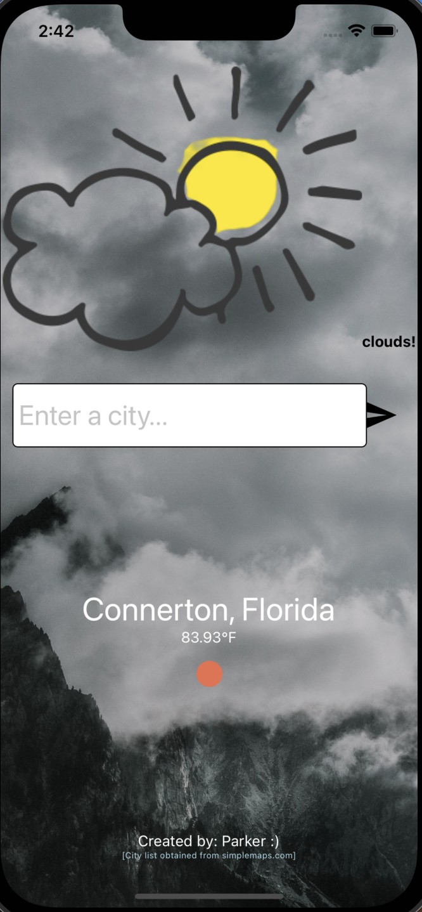

# basic weather app

weather app that's better than whatever you already use for your phone

to do:
allow user to send request to the api for their city

(now have ability to send info between screens)

# current photo of app

